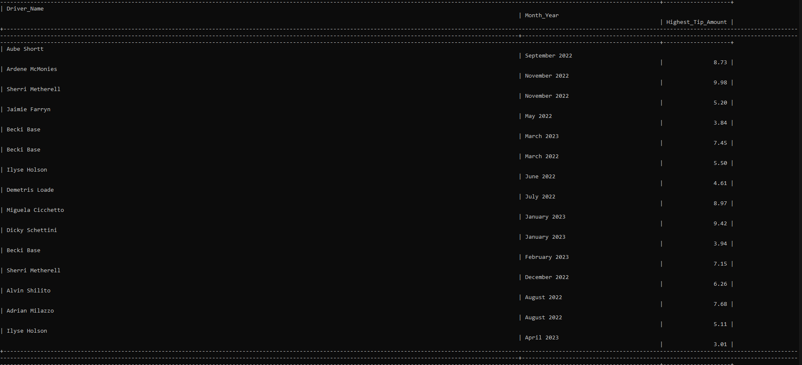

# Food Delivery App

By Adam, Kevin Soo, Steve(Chauche)

## Phase 3

Q1. Find the orders where the driver delivered faster than 20 minutes with driver name? Adam

    SELECT orders.Order_ID, 
        driver.First_Name AS driver_Name,
        TIMEDIFF(delivery.DropOff_Time, delivery.Driver_Pickup_Time) AS Delivery_Time
            FROM delivery
            INNER JOIN orders 
                ON orders.Delivery_ID = delivery.Delivery_ID
                    INNER JOIN driver
                    ON driver.Driver_ID = orders.Driver_ID
                         WHERE TIMEDIFF(delivery.DropOff_Time, delivery.Driver_Pickup_Time) < "00:20:00"
                            ORDER BY Delivery_Time ASC;
                        

Q2.  HIghest tip amount per month? Adam

    SELECT 
        CONCAT(d.First_Name, ' ', d.Last_Name) AS Driver_Name, 
        DATE_FORMAT(o.Date_And_Time, '%M %Y') AS Month_Year, 
        MAX(o.Driver_Tip) AS Highest_Tip_Amount 
            FROM 
            Orders o 
                JOIN Driver d ON o.Driver_ID = d.Driver_ID 
                    WHERE 
                    o.Driver_Tip IS NOT NULL 
                        GROUP BY 
                        Driver_Name, Month_Year 
                            ORDER BY 
                            Month_Year DESC, 
                            Highest_Tip_Amount DESC;
                        
 

Q3 Merge the tables to show orders with names instead of ids, and have tips, items order, item price, tip and delivery charge? Adam?

    SELECT 
        o.Order_ID, 
        CONCAT(u.First_Name, ' ', u.Last_Name) AS User_Name, 
        CONCAT(d.First_Name, ' ', d.Last_Name) AS Driver_Name, 
        r.Restaurant_Name, 
        o.Date_And_Time, 
        od.Item_Amount, 
        m.Menu_Item, 
        m.Item_Price, 
        o.Driver_Tip, 
        o.Delivery_Charge
            FROM 
            Orders o 
            JOIN User u ON o.User_ID = u.User_ID 
            JOIN Driver d ON o.Driver_ID = d.Driver_ID 
                JOIN Restaurant r ON o.Restaurant_ID = r.Restaurant_ID 
                    JOIN order_details od ON o.Order_ID = od.Order_ID 
                        JOIN Menu m ON od.Menu_Item_ID = m.Menu_Item_ID
                        limit 5;
 
 

Q4. Match the complaint from the customer to match the resturant item to resturant name? Adam

    SELECT c.Refund_No, u.First_Name, u.Last_Name, r.Restaurant_Name, m.Menu_Item, c.Reason_Of_Refund_Comment_Box
        FROM Customer_Service c
            JOIN User u ON c.User_ID = u.User_ID
            JOIN Orders o ON c.Order_ID = o.Order_ID
            JOIN Restaurant r ON o.Restaurant_ID = r.Restaurant_ID
            JOIN order_details od ON o.Order_ID = od.Order_ID
            JOIN Menu m ON od.Menu_Item_ID = m.Menu_Item_ID
                ORDER BY c.Refund_No;

Q5. Display the restaurant's name and ID that sells Big Mac? Steve
SELECT r.Restaurant_ID, r.Restaurant_Name
    FROM menu m
        INNER JOIN restaurant r ON m.Restaurant_ID = r.Restaurant_ID
            WHERE m.Menu_Item = 'Big Mac';

Q6. Get driver who has most delivey orders? Steve
SELECT d.Driver_ID, d.First_Name, d.Last_Name, COUNT(Order_ID)
    FROM orders o
        INNER JOIN driver d 
            ON d.Driver_ID = o.Driver_ID
                GROUP BY Driver_ID
                ORDER BY COUNT(Order_ID) DESC
                LIMIT 1;
  
 

Q7 Join the User table to itself to find users who have the same contact email address. Steve
SELECT u1.User_ID, u1.Contact_Email_Address, u2.User_ID, u2.Contact_Email_Address
    FROM User u1
        JOIN User u2 ON u1.Contact_Email_Address = u2.Contact_Email_Address
        WHERE u1.User_ID < u2.User_ID;

Q8. Get the top-rated drivers, along with their average rating? Kevin

    SELECT d.First_Name, d.Last_Name, AVG(r.Driver_Rating) AS Average_Rating
        FROM Driver d
            JOIN Rating r ON d.Driver_ID = r.Driver_ID
                GROUP BY d.Driver_ID
                ORDER BY Average_Rating DESC
                LIMIT 5;

Q9. Get the total number of orders made by each restaurant, along with their address? Kevin

    SELECT r.Restaurant_Name, r.Restaurant_Address, COUNT(o.Order_ID) AS Total_Orders
        FROM Restaurant r
            JOIN Orders o ON r.Restaurant_ID = o.Restaurant_ID
                GROUP BY r.Restaurant_ID 
                ORDER BY Order_ID desc;

Q10. Get all items ordered, their prices, and amount of times it was ordered? Kevin

    SELECT o.Order_ID, m.Menu_Item, m.Item_Price, od.Item_Amount
        FROM Orders o
            JOIN User u ON o.User_ID = u.User_ID
            JOIN order_details od ON o.Order_ID = od.Order_ID
            JOIN Menu m ON od.Menu_Item_ID = m.Menu_Item_ID;

